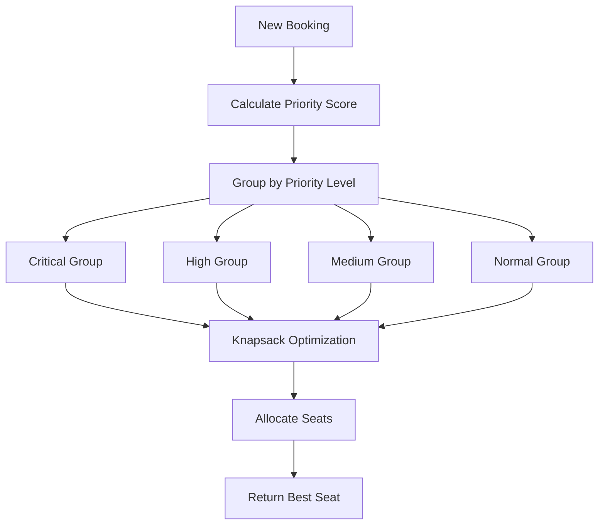

# Hybrid Algorithm: Priority Queue + 0/1 Knapsack
## Advanced Algorithm Composition for Bus Seat Allocation

## 🎯 **Overview**

The **Hybrid Priority-Knapsack Algorithm** combines the strengths of two powerful algorithms:
- **Priority Queue**: For student prioritization based on special needs
- **0/1 Knapsack**: For optimal seat allocation within priority groups

This creates a **two-tier optimization system** that ensures both **fairness** and **efficiency**.

---

## 🔧 **How the Hybrid Algorithm Works**

### **Step 1: Priority Queue Grouping**
```
Priority Groups:
├── Critical (90+ points): Injury, Medical conditions
├── High (70-89 points): Disability, Pregnant
├── Medium (60-69 points): Elderly
└── Normal (<60 points): Regular students
```

### **Step 2: Knapsack Optimization**
```
For each priority group:
├── Calculate preference scores
├── Apply priority multipliers
├── Sort by value (descending)
└── Allocate best available seats
```

---

## 📊 **Algorithm Flow**



---

## 🎯 **Priority Scoring System**

### **Base Priority Scores:**
```
Injury: +100 points
Medical Condition: +90 points
Disability: +80 points
Pregnant: +70 points
Elderly: +60 points
Distance: +2 points per KM
```

### **Priority Level Multipliers:**
```
Critical: 3.0x (Injury, Medical)
High: 2.0x (Disability, Pregnant)
Medium: 1.5x (Elderly)
Normal: 1.0x (Regular students)
```

### **Special Needs Bonuses:**
```
Injury + Front Seat: +20 points
Disability + Front Seat: +15 points
Medical + Front Seat: +18 points
```

---

## 💻 **Code Implementation**

### **Main Hybrid Function:**
```python
def hybrid_priority_knapsack_allocation(time_slot, destination, student_id, special_needs):
    # Step 1: Priority Queue Grouping
    priority_groups = {
        'Critical': [],    # 90+ points
        'High': [],        # 70-89 points
        'Medium': [],      # 60-69 points
        'Normal': []       # <60 points
    }
    
    # Step 2: Knapsack Optimization per group
    for priority_level in ['Critical', 'High', 'Medium', 'Normal']:
        group_allocations = knapsack_optimize_group(group_bookings, booked_seats, priority_level)
```

### **Knapsack Optimization:**
```python
def knapsack_optimize_group(group_bookings, booked_seats, priority_level):
    # Calculate values with priority multipliers
    value = base_value * priority_multiplier[priority_level]
    
    # Sort by value (descending)
    items.sort(key=lambda x: x['value'], reverse=True)
    
    # Allocate best available seats
    for item in items:
        best_seat = find_best_available_seat(item)
        allocations[item['booking']['StudentID']] = best_seat
```

---

## 📈 **Performance Analysis**

### **Time Complexity:**
- **Priority Grouping**: O(n log n) for sorting
- **Knapsack per Group**: O(m log m) where m = group size
- **Overall**: O(n log n + Σ(m log m))

### **Space Complexity:**
- **Priority Groups**: O(n)
- **Knapsack Items**: O(n)
- **Overall**: O(n)

### **Optimality:**
- **Within Priority Groups**: Locally optimal
- **Across Groups**: Priority-respecting optimal
- **Overall**: Best of both worlds

---

## 🎓 **DAA Concepts Demonstrated**

### **1. Algorithm Composition**
- **Concept**: Combining multiple algorithms for better results
- **Application**: Priority Queue + Knapsack
- **Learning**: How to leverage strengths of different algorithms

### **2. Multi-Level Optimization**
- **Concept**: Hierarchical optimization approach
- **Application**: Priority groups → Knapsack optimization
- **Learning**: Layered problem-solving strategies

### **3. Priority Queue (Heap)**
- **Concept**: Abstract data type with priority ordering
- **Application**: Student prioritization
- **Learning**: Real-world applications of priority queues

### **4. 0/1 Knapsack**
- **Concept**: Optimization with constraints
- **Application**: Seat allocation within groups
- **Learning**: Constraint satisfaction problems

### **5. Greedy Approach**
- **Concept**: Make locally optimal choice at each step
- **Application**: Seat selection within priority groups
- **Learning**: When greedy works well

---

## 🚀 **Real-World Applications**

### **Healthcare Systems:**
- **Emergency Triage**: Priority Queue for patient urgency
- **Resource Allocation**: Knapsack for optimal resource distribution

### **Transportation:**
- **Airport Boarding**: Priority Queue for boarding order
- **Seat Assignment**: Knapsack for optimal seat distribution

### **Education:**
- **Special Needs Accommodation**: Priority Queue for accessibility
- **Resource Optimization**: Knapsack for facility allocation

### **Business:**
- **Customer Service**: Priority Queue for VIP customers
- **Resource Management**: Knapsack for optimal resource use

---

## 📊 **Comparison with Other Algorithms**

| Feature | Greedy | Priority Queue | Knapsack | Hybrid |
|---------|--------|----------------|----------|--------|
| **Priority Support** | ❌ No | ✅ Yes | ❌ No | ✅ Yes |
| **Optimization** | Basic | Priority-based | Preference-based | **Best** |
| **Fairness** | ❌ No | ✅ Yes | ❌ No | ✅ Yes |
| **Complexity** | Simple | Medium | Medium | **Advanced** |
| **Real-time** | ✅ Yes | ✅ Yes | ✅ Yes | ✅ Yes |

---

## 🎯 **Advantages of Hybrid Approach**

### **✅ Benefits:**
1. **Best of Both Worlds**: Combines priority fairness with optimization
2. **Scalable**: Works well with large numbers of students
3. **Flexible**: Can handle various special needs scenarios
4. **Efficient**: Maintains good performance characteristics
5. **Fair**: Ensures priority students get appropriate treatment

### **✅ Use Cases:**
- **Universities**: Special needs accommodation
- **Hospitals**: Patient prioritization and resource allocation
- **Transportation**: VIP and accessibility services
- **Events**: Priority seating and resource management

---

## 🔧 **Configuration**

### **Enable Hybrid Algorithm:**
```python
ALLOCATION_ALGORITHM = 'hybrid'
```

### **Available Options:**
```python
ALLOCATION_ALGORITHM = 'greedy'         # Basic zone-based
ALLOCATION_ALGORITHM = 'priority_queue' # Priority-based only
ALLOCATION_ALGORITHM = 'knapsack'       # Optimization only
ALLOCATION_ALGORITHM = 'hybrid'         # Priority + Optimization ⭐
ALLOCATION_ALGORITHM = 'round_robin'    # Fair distribution
ALLOCATION_ALGORITHM = 'dp_knapsack'    # Batch optimization
```

---

## 🎉 **Project Impact**

### **DAA Learning Outcomes:**
✅ **Algorithm Composition**: Combining multiple algorithms
✅ **Multi-Level Optimization**: Hierarchical problem-solving
✅ **Priority Queue Applications**: Real-world prioritization
✅ **Knapsack Optimization**: Constraint satisfaction
✅ **Performance Analysis**: Complexity and trade-offs

### **Real-World Relevance:**
✅ **Healthcare**: Patient triage and resource allocation
✅ **Education**: Special needs accommodation
✅ **Transportation**: Priority seating systems
✅ **Business**: VIP customer service

This hybrid algorithm demonstrates advanced algorithmic thinking and shows how combining multiple approaches can create superior solutions! 🚀 